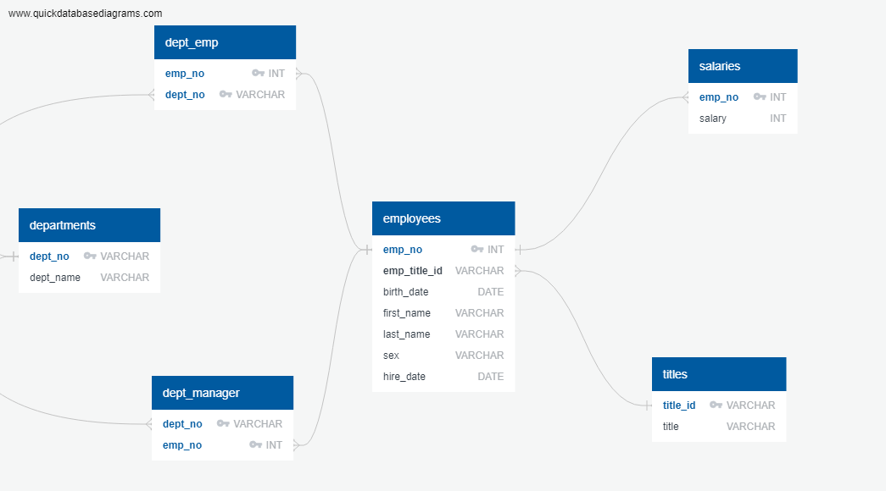
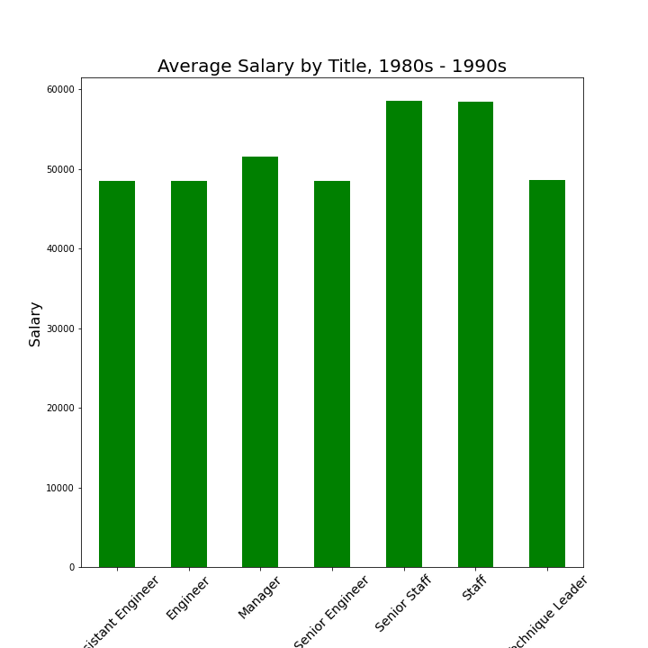
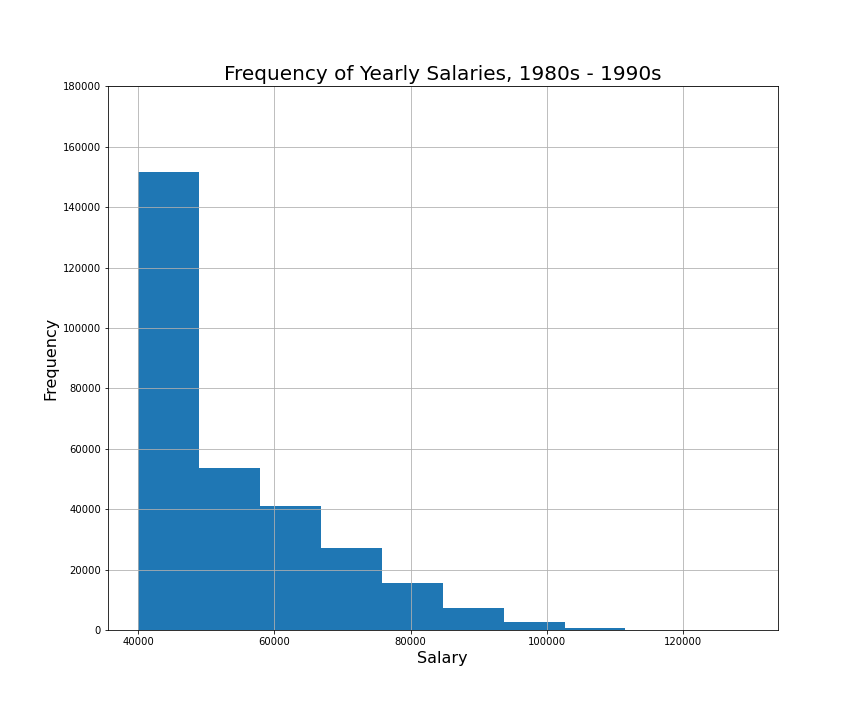

# sql-challenge# SQL  Employee Database: A Mystery in Two Parts

## Background

It is a beautiful spring day, and it is two weeks since you have been hired as a new data engineer at Pewlett Hackard. Your first major task is a research project on employees of the corporation from the 1980s and 1990s. All that remain of the database of employees from that period are six CSV files.

In this challenge, I designed the tables to hold data in the CSVs, imported the CSVs into a SQL database, and answered questions about the data. 

1. Data Engineering and Data Analysis was used for this challenge.

#### Data Modeling

The CSVs were inspected and an ERD of the tables was sketched out. 

#### Data Engineering

* A table schema was created for each of the six CSV files. 

* Each CSV file was imported into the corresponding SQL table.
